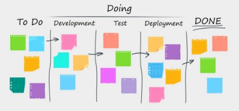

10/1/2022

** 		      

*Aplicación web EcoEco*

2º Desarrollo de aplicaciones web 

**Autor: Álvaro Córcoles Faire**

Repositorio GitHub: 

https://github.com/Alewar2000/EcoEco

**CPIFP LOS ENLACES**

**Tutor: Luis Miguel Morillas**
# **ÍNDICE**
**1. Descripción del proyecto**

1.1 Contexto del proyecto

1.2 Objetivo del proyecto

**2. Documento de Acuerdo del proyecto.**

2.1 Requisitos 

2.1.1 Requisitos funcionales

2.1.2 Requisitos no funcionales 

2.2 Tareas

2.3 Metodología a seguir para la realización del proyecto.

2.4 Planificación temporal de tareas.

2.5 Presupuesto (gastos, ingresos, beneficio)

2.6 Análisis de riesgos

2.7 Contrato/Pliego de condiciones

**3. Documento de análisis y diseño**

3.1 Modelado de datos. Análisis y diseño de la base de datos

3.2 Análisis y diseño del sistema funcional

3.3 Análisis y diseño de la interfaz de usuario. Mockups.

3.4 Diseño de la arquitectura de la aplicación

**4. Documento de implementación e implantación del sistema**

4.1 Implementación

4.2 Instalación/Despliegue y configuración.

**5. Documento de cierre**

5.1 Resultados obtenidos y conclusiones.

5.2 Diario de bitácora

**6. Bibliografía.**

**7. Anexos.**

**ANEXO I**

**ANEXO II – SQL\_ BBDD**

**1. Descripción del proyecto**
1. ## **Contexto del proyecto**
   1. ## ***Ámbito y contexto*** 
Nuestra sociedad ha sido sometida a un cambio de paradigma en la cual la incertidumbre generada por la pandemia del coronavirus nos ha puesto en un momento difícil donde más que nunca nos hemos dado cuenta de la gran importancia de la salud.

Por lo cual estamos ante una situación única por la cual hay una oportunidad para dar forma a la recuperación económica y sanitaria que tanto necesitamos. Debido a esto me ha motivado a realizar un proyecto en el cual los productos promocionados en mi aplicación sean saludables para las personas y para el medio ambiente. 

Además, también me ha alentado la necesidad de cubrir un nicho de mercado que sigue en desarrollo y que creo firmemente va a cobrar una gran importancia en los próximos años debido a la necesidad de un cambio de mentalidad en la población y de las medidas ecológicas que han planteado los gobiernos del mundo para el futuro.

1. ## ***Análisis de la realidad***
En la actualidad el marketplace se posiciona ya como canal de compra favorito por los consumidores en Internet, en muchos casos muy por encima de las páginas web de las propias tiendas.

Además, se destaca que el precio, la variedad de productos y las ofertas son las principales variables que tienen en cuenta los internautas para realizar sus compras online en los marketplaces.

Por otra parte, existen muchos sectores no tan conocidos como el de la ropa ecológica, la cosmética “healthy” o incluso de la tecnología con productos como memorias USB reciclables u ordenadores de bambú. De manera que un marketplace les podría dar la visibilidad necesaria para conseguir un crecimiento exponencial.

Por lo que hoy en día muchos negocios ecológicos necesitan un lugar en Internet y una mayor visibilidad que podrán conseguir a través del mercado de mi aplicación con productos respetuosos con la salud y medio ambiente. Así como la facilidad de la venta de productos realizados por particulares.

El proyecto de este Marketplace lo voy a realizar desde cero, realizando una interfaz fácil y sencilla para clientes y proveedores, además de variados servicios en el ámbito on-line y de logística.

1. ## ***Solución y justificación de la solución propuesta***
Con mi aplicación las empresas y particulares podrán publicar sus productos ecológicos para una mayor visibilidad y poder competir con precios competitivos, así también los negocios podrían conseguir una mayor influencia en Internet.

Actualmente las pequeñas empresas y particulares de productos ecológicos necesitan de una mayor visibilidad de mercado por lo que necesitan de hacer una mayor presencia en internet. Por consiguiente, mi aplicación se encargaría de establecer estrategias que les permitan mejorar la visibilidad de su marca, la cual está estrechamente ligada con el establecimiento de relaciones que les permite identificar quién es su cliente potencial y cuáles son sus necesidades.

También considero que esta aplicación web puede ser muy bien acogida entre el pequeño empresariado y los particulares pues voy a crear una aplicación que se pueda manejar de manera intuitiva y sencilla por lo que podrán controlar sus productos a la venta, así también se les facilitará la comunicación con sus clientes. Se trata de facilitar el trabajo al anotar los pedidos entrantes, así como también el seguimiento de incidencias. 

Por otra parte, desde el enfoque del artículo es interesante entender que lo más importante de la fidelización, es enganchar al cliente para conocerlo, y con ello ser parte de su proceso de funcionamiento de compra habitual, para generar una relación fiel que a su vez permita un vínculo con los proveedores que ofertan, innovan y han sido capaces de generar un entorno adaptado a sus preferencias y necesidades. Para ello se creará un ecosistema donde se puedan encontrar dentro de la aplicación se puedan encontrar continuas novedades, ofertas, cupones, exclusividades, etc.

1. ## ***Destinatarios***
Al principio los destinatarios principales serán empresas y negocios de baja y mediana capitalización y particulares los cuales podrán promocionar sus productos y marca personal en internet. 

Por consiguiente, los productos vendidos estarán dirigidos al público en general, el cual se ve en la necesidad de sostener una vida saludable además del cambio de paradigma a un planeta más sostenible y saludable.

Al principio se destinará a empresas en territorio nacional y con el paso de los años y el desarrollo de la empresa y aplicación, se pretende expandirla al territorio internacional, por lo que se plantea la expansión de oficinas y creación de nuevas sedes, desarrollo de la aplicación en el ámbito internacional, etc.

1. ## **Objetivo del proyecto**
El objetivo principal del proyecto es el desarrollo de una página web que permita a las empresas y particulares a vender sus productos, llevar una información más fluida y rápida de los pedidos realizados, como controlar la su imagen en internet y conseguir una gestión integral de la atención al cliente.

Para ello se analizan las necesidades de la población y de esta manera se seleccionará las empresas que quieran promocionarse y vender sus productos en la aplicación, también se buscará identificar las características y requisitos necesarios para conseguir un producto que se adapte perfectamente a las necesidades del cliente y la plataforma.

La estructura de la aplicación contara de:

\- Administración: Para poder gestionar los productos, comentarios, opiniones que no cumplan los requisitos de la aplicación.

\- Proveedores: Registro, login, pedidos, incidencias y otros

\- Registro de clientes: Registro, login, pedidos, incidencias y otros

\- Portal de productos: Ofertas, promociones, buscador

The main objective of the project is the development of a web page that allows companies and individuals to sell their products, provide more fluid and faster information on orders placed, how to control their image on the internet and achieve comprehensive management of the Customer Support.

For this, the needs of the population are analyzed and in this way the companies that want to promote themselves and sell their products in the application will be selected, it will also seek to identify the characteristics and requirements necessary to achieve a product that perfectly adapts to the customer's needs and the platform.

The structure of the application will have:

\- Administration: To be able to manage the products, comments, opinions that do not meet the requirements of the application.

\- Suppliers: Registration, login, orders, incidents and others

\- Customer registration: Registration, login, orders, incidents and others

\- Products portal: Offers, promotions, search engine

# **2. Documento de Acuerdo del proyecto**
## **2.1 Requisitos**
## ***2.1.1 Requisitos funcionales*** 

## ***2.1.2 Requisitos no funcionales***

## **2.2 Tareas**

## **2.3 Metodología**
`	`Metodologías agiles

Con las metodologías ágiles lo que voy a conseguir es adaptar la forma de trabajo a las condiciones del proyecto, consiguiendo flexibilidad e inmediatez en la respuesta para amoldar el proyecto y su desarrollo a las circunstancias específicas del entorno.

**Kanban**

He decidido utilizar la metodología ágil llamada Kanban la cual consiste en que el trabajo se divide en 3 pasos básicos: lo que hay que hacer, lo que se está haciendo y lo que se ha hecho.

Por lo tanto, el método Kanban se basa en un sistema de señalización en el que se visualizan las tareas de producción por demanda mediante tarjetas.

## **2.4. Planificación temporal de tareas**

|Actividad|Duración|Noviembre|Diciembre|Enero|
| :-: | :-: | :-: | :-: | :-: |
|||
|T1 Elección proyecto a realizar.|1 días|||||||||||
|T2 Descripción de las tareas a realizar y planificación temporal |2 días|||||||||||
|T3 Realización del presupuesto|4 días|||||||||||
|T4 Definir entorno de hardware y software|1 día|||||||||||
|T5 Documento Análisis y Diseño del Primer Sprint|9 días|||||||||||
|T5.1 Diseño de la interfaz|2 días|||||||||||
|T5.2 Diagrama de casos de uso.|1 día|||||||||||
|T5.3 Diseño de BBDD|4 días|||||||||||
|T5.4 Diseño de la gestión e interfaz de usuarios|2 días|||||||||||
|T5.4.1 Sección Clientes|1 día|||||||||||
|T5.4.2 Sección Proveedores|1 día|||||||||||
|T6 Implementación del primer sprint.|14 días|||||||||||
|T7 Pruebas de software de lo implementado en el Primer Sprint|1 día|||||||||||
|T8 Documento Análisis y Diseño del Segundo Sprint|8 días|||||||||||
|T8.1 Desarrollo de gestor de productos|4 días|||||||||||
|T8.2 Desarrollo en servidor de las nuevas pantallas|4 días|||||||||||
|T9 Implementación del segundo sprint|14 días|||||||||||
|T10 Desarrollo de funcionalidades de menor importancia|1 día|||||||||||
|T11 Implementación final|3 día|||||||||||
|T12 Pruebas de software integridad sistema|1 día|||||||||||
|T13 Documento de instalación, documento de manual de usuario y documento de cierre|3 días|||||||||||
|T14 Entrega del producto al cliente (día 30)|-|||||||||||

## **2.5 Presupuesto (gastos, ingresos, beneficio)**
A la hora de realizar el presupuesto para la creación de la aplicación web es muy importante y necesario estimar el número de horas que va a costar el proyecto y en función de eso, el tipo de tareas realizadas y los gastos fijos/variables para extraer el conjunto del presupuesto.

El gasto total se distribuye entre el costo fijo y el costo variable, en el costo fijo encontramos tales como el suministro local, internet, los programas utilizados y las horas trabajadas. Mientras que los costos variables serán el material de oficina, dominio, etc.

***- Beneficios***

El precio de venta de la aplicación constara de un precio de 13.500 €, teniendo en cuenta que de costes totales se remite a 9.430€. El beneficio total será el ingreso total que en este caso es el precio de venta de la aplicación menos los costes totales a la hora de realizarla.

Beneficios=13.500 – 9430= 4070€

## **2.6 Análisis de riesgos**
\1. Inyección

Es una vulnerabilidad de las aplicaciones WEB, que afecta directamente a las bases de datos de la aplicación. Una inyección SQL, LDAP o CRLF consiste en insertar o en inyectar código SQL malicioso dentro de código SQL para alterar el funcionamiento normal y hacer que se ejecute el código “malicioso” dentro del sistema.

\2. Pérdida de autenticación

Las vulnerabilidades relacionadas con la pérdida de autenticación son críticas en la seguridad de las aplicaciones y en especial de las aplicaciones WEB, ya que permiten a un usuario suplantar la personalidad de otro. Existen muchas situaciones en la que nos encontramos ante una aplicación WEB vulnerable a este tipo de ataque, pero la mayor parte de las veces se encuentran en la gestión de las contraseñas, la expiración de sesiones o el proceso de cierre de sesión.

\3. Exposición a datos sensibles

Las aplicaciones WEB que no protegen adecuadamente los datos confidenciales, como datos financieros, nombres de usuario y contraseñas, o información de salud, podrían permitir a los atacantes acceder a dicha información para cometer fraudes o robar identidades.

## **2.7 Contrato / Pliego de condiciones**
La copia del contrato y el pliego de condiciones a las cuales se exponen las dos partes se adjuntará en el Anexo I de esta documentación.

# **3. Documento de análisis y diseño**
## **3.1 Modelado de datos. Análisis y diseño de la base de datos**

Modelo Entidad-Relación

## **3.2 Análisis y diseño del sistema funcional**
## ***3.2.1 Registro de usuarios***

## ***3.2.2 Casos de uso cliente***

1. ## ***Casos de uso vendedor***

## **3.3 Análisis y diseño de la interfaz de usuario. Mockups.**
Portal web

Cliente

Producto

Vendedor

## **3.4 Diseño de la arquitectura de la aplicación**
## ***3.4.1Tecnologías/Herramientas usadas y descripción de las mismas.***

PHP, HTML, CSS, Bootstrap, JavaScript

*PHP*

Los e-commerces tienen una gran necesidad, que es la comunicación frecuente con bases de datos complejas y llenas de elementos importantes. Por lo que la utilización de PHP es vital, para el desarrollo de la aplicación, siendo el lenguaje principal para programar su back-end.

*JavaScript*

JavaScript es el lenguaje de programación que voy a usar para añadir características interactivas a mi sitio web. Tales como botones interactivos con formularios, etc.

*Bootstrap*

Puedo tener la aplicación bien organizada de forma visual rápidamente. Además, permite utilizar muchos elementos web: desde iconos a desplegables, combinando HTML5, CSS y JavaScript.

*Base de datos:*

MySQL

MySQL sirve para almacenar toda la información que se desee en bases de datos relacionales, como también para administrar todos estos datos sin apenas complicaciones gracias a su interfaz visual y a todas las opciones y herramientas de las que dispone. Es algo esencial, sobre todo en webs que cuentan con la opción de registrar usuarios para que inicien sesión.

## ***3.4.2 Arquitectura de componentes de la aplicación.***
Laravel

Laravel es un framework PHP. Es uno de los frameworks más utilizados y de mayor comunidad en el mundo de Internet.

Razones de utilización:

\- Como framework resulta bastante moderno y ofrece muchas utilidades potentes a los desarrolladores, que permiten agilizar el desarrollo de las aplicaciones web.

\- Laravel pone énfasis en la calidad del código, la facilidad de mantenimiento y escalabilidad, lo que permite realizar proyectos desde pequeños a grandes o muy grandes. Además, promueve las mejores prácticas y un esquema de carpetas para tener una buena estructura.

\- También es un fácil entorno de conexión a base de datos y manejo de la misma, debido a que consiste solamente en configurar el archivo .env, especificando el servidor en el que está alojada, el nombre de la base de datos y las credenciales del usuario que las ha creado.

**4. Documento de implementación, pruebas e implantación del sistema**

4.1 Implementación

Implementación general

Para la implementación del proyecto lo he realizado en una base de datos local, a través de un esquema modelo-vista-controlador. He utilizado xampp para la ejecución del servidor y la base de datos.

Con un esquema de plantillas .blade he creado las vistas, siguiendo un orden entre vistas para una mejor organización y visualización.

Vistas

La implementación de vistas se ha realizado a través de un sistema de plantillas propio de laravel llamado .blade, el cual a través de sections, yield()… se puede organizar de manera muy simple, a través del archivo routes redirecciono las rutas para cada cada metodo de los controladores.

CSS

Para la maquetación he utilizado stylus, un lenguaje preprocesador de hojas de estilo dinámico que se compila en hojas de estilo en cascada.

Para ello utilizaba a través de consola el comando en la ruta del archivo .styl:

stylus admin.styl -c -w

BBDD

La configuración de la base de datos se ha realizado a través del fichero .env indicando nombre, ruta, contraseñas…

En cuanto a la implementación y creación de las tablas y relaciones, he utilizado migraciones indicando los campos, tipos de datos, posiciones… Los controladores solicitan los datos a través deconsultas sql con métodos de laravel, tales como:

->get() ->first() ->table

Ejemplo:

$products = DB::table('products')->get();

Y por último los datos recogidos se muestran a través de las vista.

Permisos y validaciones

A la hora de controlar los permisos he utilizado middlewares que controlan los permisos de ejecución de los métodos y acceso a vistas a través del rol de cada usuario, almacenado en la base de datos.

En cuanto a las validaciones se ha comprobado en cada formulario (login, register, reset, añadir productos, editar productos, añadir categorías…) ya sea en el backend y en el frontend. Además he encriptado las contraseñas y los inputs son validados para que no se pueda inyectar código, a través de la función e().

Librerías

En cuanto a las librerías he implementado las siguientes:

`        `guzzlehttp/guzzle": "^7.4",

`        `intervention/image": "^2.7",

`        `laravel/socialite": "^5.2",

`        `laravel/tinker": "^2.5",

`        `laravelcollective/html": "^6.2"

4.2 Instalación/Despliegue y configuración.

En cuanto al despliegue de la aplicación he utilizado xampp, el cual al configurar las rutas del servidor (httpd.conf) para que ejecute el proyecto de manera automática cada vez que se enciende apache, también he configurado el my.ini para el despliegue de la base de datos de manera local.

Para la instalación de envió de correos para la recuperación de contraseña a través del servidor he tenido que configurar el archivo .env y instalar paquetes de mensajería.

**5. Documento de cierre**

5.1 Resultados obtenidos y conclusiones.

Los principales resultados obtenidos ha sido la implementación de un sistema de administración (CRUD) para la creación de productos, categorías y usuarios. La creación de usuarios y control de permisos según sus roles. La implementación del modelo-vista-controlador. Un sistema de envío de correos automáticos. La validación de formularios, encriptación de claves y previsión de código malicioso.

5.2 Diario de bitácora

**Commit: Producto plantilla y más modificaciones**

**Error encontrado: Si buscas un producto que no existe, sale error**

$product = Product::find($id)

**Solución:**

$product = Product::findOrFail($id)

Not Found Exceptions

Sometimes you may wish to throw an exception if a model is not found. This is particularly useful in routes or controllers.

<https://laravel.com/docs/8.x/eloquent#not-found-exceptions>

**Commit: Add products, librerias y maquetación**

**Error encontrado: CKEditor – No se muestra**

Inicialización del editor en un .js a través un id en el html de la descripción del producto

function editor\_init(field){

`	`CKEDITOR.replace(field,{

`		`toolbar: [

`		`{ name: 'clipboard', items: [ 'Cut', 'Copy', 'Paste', 'PasteText', '-', 'Undo', 'Redo' ] },

`		`{ name: 'basicstyles', items: [ 'Bold', 'Italic', 'BulletedList', 'Strike', 'Image', 'Link', 'Unlink', 'Blockquote' ] },

`		`{ name: 'document', items: ['CodeSnippet', 'EmojiPanel','Preview', 'Source'] }

`		`]

`	`});

**Commit: Restablecer contraseña**

**Enviar correos electrónicos, cambio de contraseña en la base de datos, reseteo de la contraseña mediante un código.**

**[Recover y reset]**

Error encontrado:

Failed to authenticate on SMTP server with username

Solución acivar en la cuenta de Google y el acceso a apps menos seguras y cambiar el mail.host por uno funcional.

<https://docs.luisjorquera.com/laravel-send-a-email>

# **ANEXO I**
**CONTRATO DE DISEÑO WEB**

En\_\_\_\_\_\_\_\_\_, a\_\_ de \_\_\_\_\_ de 20\_\_

**REUNIDOS**

D\_\_\_\_\_\_\_\_\_\_\_\_\_\_\_\_\_\_\_\_\_\_\_\_\_\_, mayor de edad, con DNI\_\_\_\_\_\_\_\_\_\_\_\_\_\_\_\_\_\_\_ y domicilio en\_\_\_\_\_\_\_\_\_\_\_\_\_\_\_\_\_\_\_\_\_\_\_\_\_\_\_\_\_\_\_\_\_\_\_\_\_\_\_\_\_\_\_, actuando en nombre y representación de\_\_\_\_\_\_\_\_\_\_\_\_\_\_\_\_\_\_\_\_\_\_\_\_ inscrita en el Registro Mercantil de.\_\_\_\_\_\_\_\_\_\_\_\_\_\_\_\_\_\_\_\_\_\_ con domicilio social en\_\_\_\_\_\_\_\_\_\_\_\_\_\_\_\_\_\_\_\_\_\_\_\_\_,  actuando en su calidad de \_\_\_\_\_\_\_\_\_\_\_\_\_\_\_\_, en posesión de poderes suficientes para este acto. (El Desarrollador)

D\_\_\_\_\_\_\_\_\_\_\_\_\_\_\_\_\_\_\_\_\_\_\_\_\_\_, mayor de edad, con DNI\_\_\_\_\_\_\_\_\_\_\_\_ y domicilio en\_\_\_\_\_\_\_\_\_\_\_\_\_\_\_\_\_\_\_\_\_\_\_\_\_\_\_\_\_\_\_\_\_\_\_\_\_\_\_\_\_\_\_, actuando en nombre y representación de\_\_\_\_\_\_\_\_\_\_\_\_\_\_\_\_\_\_\_\_\_\_\_\_ inscrita en el Registro Mercantil de.\_\_\_\_\_\_\_\_\_\_\_\_\_\_\_\_\_\_\_\_\_\_, en calidad de\_\_\_\_\_\_\_\_\_\_\_\_\_\_\_\_\_\_\_\_, en posesión de poderes suficientes para este acto. (El cliente)

**MANIFIESTAN**

Que las partes están interesadas en formalizar el presente contrato; que poseen suficientes poderes para la firma del mismo; que se reconocen capacidad legal necesaria para poder llevar a cabo la celebración y declaran expresamente que actúan de forma libre, voluntaria y no viciada.

**EXPONEN**

El cliente está interesado en que el prestador lleve a cabo el diseño y desarrollo de una página Web conforme a las necesidades específicas indicadas en el Anexo I.

Que el prestador tiene como objeto el diseño y desarrollo de páginas Web y cuenta con el personal necesario para ello; que las características de la página Web son las indicadas en el Anexo I por el cliente; que ambas partes aceptan cumplir con sus respectivas obligaciones.

En relación a lo anteriormente expuesto, las partes otorgan el presente contrato que se regirá por las siguientes

**CLAUSULAS**

**I. OBJETO DEL CONTRATO**

El presente contrato regula la prestación de servicio de diseño y programación Web solicitada por el cliente. El sitio Web se acogerá en todo caso a las categorías, diseño y contenidos indicados en el Anexo I.

**II. PROPIEDAD INTELECTUAL**

El prestador garantiza al cliente que todo el material utilizado para el desarrollo del proyecto, así como el resultado obtenido, es un producto original que no vulnera ninguna ley o derechos de terceros, en especial los referidos a propiedad industrial e intelectual.

El prestador reconoce los derechos de explotación sobre la obra. El prestador renuncia de forma indefinida a ejercitar cualquier tipo de acción para recuperar sus derechos de propiedad intelectual respecto al desarrollo, a excepción del derecho de autoría por el que el desarrollador tiene derecho a exigir que aparezca su nombre o un link al su sitio Web.

En caso de ser el cliente el encargado de proporcionar los contenidos (gráficos, textos, vídeos, categorías…), éste se hace responsable de cualquier tipo de reclamación de terceros en relación a la titularidad de dichos contenidos, eximiendo de toda responsabilidad al prestador.

**III. OBLIGACIONES DEL PRESTADOR**

El prestador se compromete a desarrollar el presente proyecto bajo las directrices del cliente, ajustándose a los términos indicados por éste en el Anexo I y conforme a las mejores prácticas existentes en el mercado, así como con la máxima diligencia posible.

Una vez aceptadas las características del sitio Web pueden producirse variaciones en el diseño y/o contenido del mismo a petición del cliente. Salvo que conllevaran una variación sustancial del Proyecto Inicial no supondrá aumento del precio, considerando variación sustancial toda aquello que suponga un aumento del tiempo total de trabajo estimado inicialmente superior al \_\_\_%.

El prestador se compromete a finalizar el desarrollo en el plazo acordado siempre que la otra parte haya colaborado activamente en el desarrollo del mismo (aceptando los diseños, entregando los contenidos, etc)

**IV. OBLIGACIONES DEL CLIENTE**

El cliente se obliga a realizar el pago del precio en los términos indicados en la cláusula VI del presente contrato.

El cliente se obliga a mantener un contacto constante con el prestador entregando en tiempo y forma los contenidos del proyecto Web (Textos, imágenes, videos, categorías…), la aceptación del diseño y cualquier otra necesidad que requiera el prestador para poder finalizar el proyecto. En cualquier caso se atenderá a lo dispuesto respecto a propiedad intelectual en la cláusula II.

En caso de depender la entrega de contenidos de un tercero seleccionado por el cliente, éste deberá indicarlo en el apartado comunicaciones y comprometiéndose a responder de los posibles retrasos que pudieran darse. 

**V. COMUNICACIONES**

Las partes se obligan a comunicarse toda la información que pudiera ser necesaria para el correcto desarrollo del proyecto. Toda comunicación entre las partes relativa al presente contrato se realizará por escrito o telefónicamente. A efectos de comunicaciones y/o notificaciones las partes designan:

**Prestador**

Domicilio en \_\_\_\_\_\_\_\_\_\_\_\_, con número de Fax \_\_\_\_\_\_\_\_\_\_\_, correo electrónico \_\_\_\_\_\_\_\_\_\_\_\_\_\_ y Teléfono \_\_\_\_\_\_\_\_\_\_\_

**Cliente**

Domicilio en \_\_\_\_\_\_\_\_\_\_\_\_, con número de Fax \_\_\_\_\_\_\_\_\_\_\_, correo electrónico \_\_\_\_\_\_\_\_\_\_\_\_\_\_ y Teléfono \_\_\_\_\_\_\_\_\_\_\_

**Tercero**

Domicilio en \_\_\_\_\_\_\_\_\_\_\_\_, con número de Fax \_\_\_\_\_\_\_\_\_\_\_, correo electrónico \_\_\_\_\_\_\_\_\_\_\_\_\_\_ y Teléfono \_\_\_\_\_\_\_\_\_\_\_

Cualquier cambio de domicilio o dirección de contacto deberá ser comunicado a la otra parte por escrito con una antelación mínima de \_\_\_\_\_ días hábiles.

**VI. DURACIÓN Y PRECIO**

El presente contrato entrará en vigor el día \_\_\_\_de\_\_\_\_\_\_\_de 20\_\_ y tendrá una duración de \_\_\_\_\_\_\_días/meses, siendo posible, a petición del prestador, añadir \_\_\_\_ días adicionales para llevar a cabo la entrega del proyecto, sin ello suponer repercusión económica alguna.

El precio a abonar por parte del cliente como pago por la prestación del servicio prestado equivale a \_\_\_\_\_\_\_\_\_\_ € ( \_\_\_\_\_\_\_\_ euros), añadiendo a dicha cantidad el IVA correspondiente (16%)

Dicho precio será abonado de la siguiente forma:

a) \_\_\_\_\_\_\_\_\_\_ € ( \_\_\_\_\_\_\_\_ euros), que corresponden al \_\_\_\_\_ % del precio, serán abonados en el momento de la firma del presente contrato.

b) El \_\_\_\_ % restante,  equivalente a \_\_\_\_ € (\_\_\_\_\_\_\_\_ euros), serán abonados en el momento de finalización del proyecto.

El pago del \_\_\_\_ % final será llevado a cabo siempre que el prestador de por finalizado el proyecto y en cualquier caso cuando se cumpla el plazo de entrega y el cliente no haya entregado o colaborado activamente en la entrega de contenidos, validación de colores y diseño  o entrega de categorías del sitio Web.

El pago será realizado mediante transferencia Bancaria en el número de cuenta \_\_\_\_\_\_\_\_\_\_\_\_\_\_\_\_\_\_\_\_\_.

**VIII. CONFIDENCIALIDAD Y PROTECCIÓN DE DATOS**

Las partes contratantes declaran conocer y cumplir la legislación Europea y Española sobre protección de datos, comprometiéndose a tratar los datos personales obtenidos durante el desarrollo del proyecto de acuerdo con dicha normativa.

Se informa al cliente que sus datos quedarán almacenados en un fichero, automatizado o no, con las únicas finalidades de informarle sobre novedades y nuevos proyectos en los que se encuentre trabajando la empresa prestadora, así como para el mantenimiento de la relación contractual.

Se informa al afectado que puede ejercer los derechos de acceso, rectificación, cancelación y oposición de sus datos de carácter personal solicitándolo por escrito y acompañando una fotocopia del DNI en la dirección del prestador indicada en el presente contrato.

Toda la información relativa al proyecto, así como a los datos de carácter personal, tendrá el carácter de confidencial por lo que las partes deberán guardar el mayor secreto respecto a las mismas, garantizando en todo caso el no acceso por parte de terceros a dicha información.

**XI. NO COMPETENCIA**

El cliente se compromete a no realizar proyectos de equivalente o análoga naturaleza para un tercero, ni iniciar a partir del presente desarrollo una nueva línea de negocio relacionada con la realización de sitios Web. Se considerará que el cliente incurre en dicha circunstancia siempre que opere directamente o indirectamente mediante otra empresa en la que disponga de participación social, o que actúe como mero asesor o colaborador y que en definitiva obtenga como resultado un proyecto igual, semejante o con la misma finalidad a la ofrecida por el prestador. 

El incumplimiento del anterior compromiso llevará aparejada una penalización equivalente a \_\_\_\_\_\_ €, sin perjuicio y de las indemnizaciones que correspondiesen por los daños y perjuicios causados al prestador.

**XI. EXTINCIÓN**

Además de por las causas generales del Derecho , este contrato se extinguirá:

1. Por el transcurso del mismo.
1. Por ser declarados en situación de suspensión de pagos, quiebra o concurso de acreedores cualquiera de las partes.
1. Por incumplimiento de las obligaciones estipuladas en el presente contrato. 

Las partes aceptan expresamente el sometimiento a las penalizaciones económicas indicadas a continuación siempre que se rescinda el contrato de forma previa a la finalización del proyecto:

**XII JURISDICCIÓN Y LEGISLACIÓN APLICABLE**

Todas las  cuestiones litigiosas sobre el presente contrato mercantil, quedarán regidas por la  legislación española, específicamente por lo dispuesto en el Código Mercantil, y en su defecto, por las disposiciones españolas del Código de Comercio, Leyes Especiales, usos mercantiles y con carácter supletorio, por el Código Civil.

En cualquier caso, será obligatorio que en caso de conflicto las partes intenten previamente resolver la cuestión de mutuo acuerdo, sometiéndose en su caso a los Juzgados y Tribunales de \_\_\_\_\_\_\_\_\_ que por orden correspondan.

# **ANEXO II**
SQL - BBDD

-- phpMyAdmin SQL Dump

-- version 5.0.3

-- https://www.phpmyadmin.net/

\--

-- Servidor: 127.0.0.1

-- Tiempo de generación: 10-01-2022 a las 04:38:24

-- Versión del servidor: 10.4.14-MariaDB

-- Versión de PHP: 7.4.11

SET SQL\_MODE = "NO\_AUTO\_VALUE\_ON\_ZERO";

START TRANSACTION;

SET time\_zone = "+00:00";

/\*!40101 SET @OLD\_CHARACTER\_SET\_CLIENT=@@CHARACTER\_SET\_CLIENT \*/;

/\*!40101 SET @OLD\_CHARACTER\_SET\_RESULTS=@@CHARACTER\_SET\_RESULTS \*/;

/\*!40101 SET @OLD\_COLLATION\_CONNECTION=@@COLLATION\_CONNECTION \*/;

/\*!40101 SET NAMES utf8mb4 \*/;

\--

-- Base de datos: `ecoeco`

\--

\-- --------------------------------------------------------

\--

-- Estructura de tabla para la tabla `categories`

\--

CREATE TABLE `categories` (

`  ``id` bigint(20) UNSIGNED NOT NULL,

`  ``module` int(11) NOT NULL,

`  ``name` varchar(255) COLLATE utf8mb4\_unicode\_ci NOT NULL,

`  ``slug` varchar(255) COLLATE utf8mb4\_unicode\_ci NOT NULL,

`  ``icono` varchar(255) COLLATE utf8mb4\_unicode\_ci NOT NULL,

`  ``deleted\_at` timestamp NULL DEFAULT NULL,

`  ``created\_at` timestamp NULL DEFAULT NULL,

`  ``updated\_at` timestamp NULL DEFAULT NULL

) ENGINE=InnoDB DEFAULT CHARSET=utf8mb4 COLLATE=utf8mb4\_unicode\_ci;

\--

-- Volcado de datos para la tabla `categories`

\--

INSERT INTO `categories` (`id`, `module`, `name`, `slug`, `icono`, `deleted\_at`, `created\_at`, `updated\_at`) VALUES

(1, 0, 'Informática', 'informatica', '&lt;i class=&quot;fas fa-laptop&quot;&gt;&lt;/i&gt;', NULL, '2022-01-06 10:44:56', '2022-01-06 10:44:56'),

(2, 1, 'Noticias', 'noticias', '&lt;i class=&quot;fas fa-sticky-note&quot;&gt;&lt;/i&gt;', NULL, '2022-01-06 11:24:21', '2022-01-06 15:25:32'),

(3, 0, 'Alimentos', 'alimentos', '&lt;i class=&quot;fas fa-apple-alt&quot;&gt;&lt;/i&gt;', NULL, '2022-01-06 15:38:36', '2022-01-06 15:38:36');

\-- --------------------------------------------------------

\--

-- Estructura de tabla para la tabla `failed\_jobs`

\--

CREATE TABLE `failed\_jobs` (

`  ``id` bigint(20) UNSIGNED NOT NULL,

`  ``connection` text COLLATE utf8mb4\_unicode\_ci NOT NULL,

`  ``queue` text COLLATE utf8mb4\_unicode\_ci NOT NULL,

`  ``payload` longtext COLLATE utf8mb4\_unicode\_ci NOT NULL,

`  ``exception` longtext COLLATE utf8mb4\_unicode\_ci NOT NULL,

`  ``failed\_at` timestamp NOT NULL DEFAULT current\_timestamp()

) ENGINE=InnoDB DEFAULT CHARSET=utf8mb4 COLLATE=utf8mb4\_unicode\_ci;

\-- --------------------------------------------------------

\--

-- Estructura de tabla para la tabla `migrations`

\--

CREATE TABLE `migrations` (

`  ``id` int(10) UNSIGNED NOT NULL,

`  ``migration` varchar(255) COLLATE utf8mb4\_unicode\_ci NOT NULL,

`  ``batch` int(11) NOT NULL

) ENGINE=InnoDB DEFAULT CHARSET=utf8mb4 COLLATE=utf8mb4\_unicode\_ci;

\--

-- Volcado de datos para la tabla `migrations`

\--

INSERT INTO `migrations` (`id`, `migration`, `batch`) VALUES

(1, '2014\_10\_12\_000000\_create\_users\_table', 1),

(2, '2014\_10\_12\_100000\_create\_password\_resets\_table', 1),

(3, '2019\_08\_19\_000000\_create\_failed\_jobs\_table', 1),

(4, '2022\_01\_06\_110816\_create\_categories\_table', 2),

(5, '2022\_01\_06\_164305\_create\_products\_table', 3),

(6, '2022\_01\_06\_180337\_add\_field\_file\_path\_to\_productrs\_table', 4),

(7, '2022\_01\_07\_142430\_create\_product\_gallery\_table', 5),

(8, '2022\_01\_07\_174430\_add\_field\_avatar\_status\_to\_usres\_table', 6),

(9, '2022\_01\_09\_153210\_add\_password\_code\_to\_users\_table', 7);

\-- --------------------------------------------------------

\--

-- Estructura de tabla para la tabla `password\_resets`

\--

CREATE TABLE `password\_resets` (

`  ``email` varchar(255) COLLATE utf8mb4\_unicode\_ci NOT NULL,

`  ``token` varchar(255) COLLATE utf8mb4\_unicode\_ci NOT NULL,

`  ``created\_at` timestamp NULL DEFAULT NULL

) ENGINE=InnoDB DEFAULT CHARSET=utf8mb4 COLLATE=utf8mb4\_unicode\_ci;

\-- --------------------------------------------------------

\--

-- Estructura de tabla para la tabla `products`

\--

CREATE TABLE `products` (

`  ``id` bigint(20) UNSIGNED NOT NULL,

`  ``status` int(11) NOT NULL,

`  ``name` varchar(255) COLLATE utf8mb4\_unicode\_ci NOT NULL,

`  ``slug` varchar(255) COLLATE utf8mb4\_unicode\_ci NOT NULL,

`  ``category\_id` int(11) NOT NULL,

`  ``file\_path` varchar(255) COLLATE utf8mb4\_unicode\_ci NOT NULL,

`  ``image` varchar(255) COLLATE utf8mb4\_unicode\_ci NOT NULL,

`  ``price` decimal(11,2) NOT NULL,

`  ``in\_discount` int(11) NOT NULL,

`  ``discount` int(11) NOT NULL,

`  ``content` text COLLATE utf8mb4\_unicode\_ci NOT NULL,

`  ``deleted\_at` timestamp NULL DEFAULT NULL,

`  ``created\_at` timestamp NULL DEFAULT NULL,

`  ``updated\_at` timestamp NULL DEFAULT NULL

) ENGINE=InnoDB DEFAULT CHARSET=utf8mb4 COLLATE=utf8mb4\_unicode\_ci;

\--

-- Volcado de datos para la tabla `products`

\--

INSERT INTO `products` (`id`, `status`, `name`, `slug`, `category\_id`, `file\_path`, `image`, `price`, `in\_discount`, `discount`, `content`, `deleted\_at`, `created\_at`, `updated\_at`) VALUES

(4, 1, 'Usb ecológico', 'producto-3', 3, '2022-01-07', '17-usb.jpg', '1123.00', 1, 20, '&lt;p&gt;123456734&lt;/p&gt;', NULL, '2022-01-06 17:21:15', '2022-01-09 16:50:45');

\-- --------------------------------------------------------

\--

-- Estructura de tabla para la tabla `product\_gallery`

\--

CREATE TABLE `product\_gallery` (

`  ``id` bigint(20) UNSIGNED NOT NULL,

`  ``product\_id` int(11) NOT NULL,

`  ``file\_path` varchar(255) COLLATE utf8mb4\_unicode\_ci NOT NULL,

`  ``file\_name` varchar(255) COLLATE utf8mb4\_unicode\_ci NOT NULL,

`  ``deleted\_at` timestamp NULL DEFAULT NULL,

`  ``created\_at` timestamp NULL DEFAULT NULL,

`  ``updated\_at` timestamp NULL DEFAULT NULL

) ENGINE=InnoDB DEFAULT CHARSET=utf8mb4 COLLATE=utf8mb4\_unicode\_ci;

\--

-- Volcado de datos para la tabla `product\_gallery`

\--

INSERT INTO `product\_gallery` (`id`, `product\_id`, `file\_path`, `file\_name`, `deleted\_at`, `created\_at`, `updated\_at`) VALUES

(1, 4, '2022-01-07', '104-usba.jfif', '2022-01-07 15:51:58', '2022-01-07 15:30:22', '2022-01-07 15:51:58'),

(2, 4, '2022-01-07', '976-usbaa.jpg', '2022-01-10 01:39:13', '2022-01-07 15:30:26', '2022-01-10 01:39:13'),

(3, 4, '2022-01-07', '564-h902-madera-usb-memorias-2.jpg', '2022-01-10 01:39:15', '2022-01-07 15:30:29', '2022-01-10 01:39:15'),

(4, 4, '2022-01-07', '762-usbb.jpg', '2022-01-10 01:39:16', '2022-01-07 15:31:01', '2022-01-10 01:39:16'),

(5, 4, '2022-01-07', '583-usba.jfif', '2022-01-10 01:39:17', '2022-01-07 15:53:58', '2022-01-10 01:39:17'),

(6, 4, '2022-01-10', '271-h902-madera-usb-memorias-2.jpg', '2022-01-10 01:43:27', '2022-01-10 01:39:23', '2022-01-10 01:43:27'),

(7, 4, '2022-01-10', '337-usbaa.jpg', '2022-01-10 01:43:29', '2022-01-10 01:39:32', '2022-01-10 01:43:29'),

(8, 4, '2022-01-10', '519-usbb.jpg', '2022-01-10 01:43:23', '2022-01-10 01:39:35', '2022-01-10 01:43:23'),

(9, 4, '2022-01-10', '484-usba.jfif', '2022-01-10 01:43:19', '2022-01-10 01:39:42', '2022-01-10 01:43:19'),

(10, 4, '2022-01-10', '941-usba.jfif', '2022-01-10 01:43:21', '2022-01-10 01:42:40', '2022-01-10 01:43:21'),

(11, 4, '2022-01-10', '147-usbb.jpg', '2022-01-10 01:43:25', '2022-01-10 01:42:42', '2022-01-10 01:43:25'),

(12, 4, '2022-01-10', '479-usbaa.jpg', '2022-01-10 01:43:30', '2022-01-10 01:42:43', '2022-01-10 01:43:30'),

(13, 4, '2022-01-10', '69-h902-madera-usb-memorias-2.jpg', '2022-01-10 01:43:31', '2022-01-10 01:42:45', '2022-01-10 01:43:31'),

(14, 4, '2022-01-10', '538-h902-madera-usb-memorias-2.jpg', NULL, '2022-01-10 01:43:34', '2022-01-10 01:43:34'),

(15, 4, '2022-01-10', '633-usbaa.jpg', NULL, '2022-01-10 01:43:40', '2022-01-10 01:43:40'),

(16, 4, '2022-01-10', '364-usbb.jpg', NULL, '2022-01-10 01:43:43', '2022-01-10 01:43:43');

\-- --------------------------------------------------------

\--

-- Estructura de tabla para la tabla `users`

\--

CREATE TABLE `users` (

`  ``id` bigint(20) UNSIGNED NOT NULL,

`  ``status` int(11) NOT NULL DEFAULT 0,

`  ``role` int(11) NOT NULL DEFAULT 0,

`  ``name` varchar(255) COLLATE utf8mb4\_unicode\_ci NOT NULL,

`  ``lastname` varchar(255) COLLATE utf8mb4\_unicode\_ci NOT NULL,

`  ``email` varchar(255) COLLATE utf8mb4\_unicode\_ci NOT NULL,

`  ``avatar` varchar(255) COLLATE utf8mb4\_unicode\_ci DEFAULT NULL,

`  ``email\_verified\_at` timestamp NULL DEFAULT NULL,

`  ``password` varchar(255) COLLATE utf8mb4\_unicode\_ci NOT NULL,

`  ``password\_code` varchar(255) COLLATE utf8mb4\_unicode\_ci DEFAULT NULL,

`  ``remember\_token` varchar(100) COLLATE utf8mb4\_unicode\_ci DEFAULT NULL,

`  ``created\_at` timestamp NULL DEFAULT NULL,

`  ``updated\_at` timestamp NULL DEFAULT NULL

) ENGINE=InnoDB DEFAULT CHARSET=utf8mb4 COLLATE=utf8mb4\_unicode\_ci;

\--

-- Volcado de datos para la tabla `users`

\--

INSERT INTO `users` (`id`, `status`, `role`, `name`, `lastname`, `email`, `avatar`, `email\_verified\_at`, `password`, `password\_code`, `remember\_token`, `created\_at`, `updated\_at`) VALUES

(1, 0, 1, 'Alvaro', 'Corcoles', 'correo@correo.com', NULL, NULL, '$2y$10$tfalo9yxbpYlnvAMdFgOSOP2uW5TXsWqQGq6Olt0nSVNbCTz8DZvW', NULL, 'GJ2l09P5rAkNqxMBbd3PBUsjiH0nYDDDMoOrrls7qNUvHN0PZlgwpRBOZ5Ud', '2021-12-19 13:19:42', '2022-01-04 13:19:42'),

(2, 0, 0, 'Jose', 'Antonio', 'antonio@gmail.com', NULL, NULL, '$2y$10$l9pBFQ6mFIhF0Fzo8XBRDu3v9BermiF4G2Wffhfv9HrA5gc53zKdy', NULL, NULL, '2022-01-04 14:29:40', '2022-01-04 14:29:40'),

(4, 0, 0, 'dfsdfs', 'dsad', 'alvarocorco@gmail.com', NULL, NULL, '$2y$10$ds7qNZ4MRWCHHRB1iSMbdueVsA5tadNLMdc7l4pfJ3He1EkPPofjy', NULL, NULL, '2022-01-09 14:57:25', '2022-01-09 14:57:25'),

(6, 0, 0, 'asd', 'asda', 'ecoecoalewar@gmail.com', NULL, NULL, '$2y$10$rYeZzQgpuwFfAOcsnry1ZuMhitAh6c.iSS7.lYtN5vnpLGHp83AZG', NULL, 'Z8NeHAjsN9EBFjrtrUsjoRmXPbXPiu3UiDhXIy8QJmLlcnYvpU0RbzGfLZPU', '2022-01-09 15:02:28', '2022-01-09 16:23:24');

\--

-- Índices para tablas volcadas

\--

\--

-- Indices de la tabla `categories`

\--

ALTER TABLE `categories`

`  `ADD PRIMARY KEY (`id`);

\--

-- Indices de la tabla `failed\_jobs`

\--

ALTER TABLE `failed\_jobs`

`  `ADD PRIMARY KEY (`id`);

\--

-- Indices de la tabla `migrations`

\--

ALTER TABLE `migrations`

`  `ADD PRIMARY KEY (`id`);

\--

-- Indices de la tabla `password\_resets`

\--

ALTER TABLE `password\_resets`

`  `ADD KEY `password\_resets\_email\_index` (`email`);

\--

-- Indices de la tabla `products`

\--

ALTER TABLE `products`

`  `ADD PRIMARY KEY (`id`);

\--

-- Indices de la tabla `product\_gallery`

\--

ALTER TABLE `product\_gallery`

`  `ADD PRIMARY KEY (`id`);

\--

-- Indices de la tabla `users`

\--

ALTER TABLE `users`

`  `ADD PRIMARY KEY (`id`),

`  `ADD UNIQUE KEY `users\_email\_unique` (`email`);

\--

-- AUTO\_INCREMENT de las tablas volcadas

\--

\--

-- AUTO\_INCREMENT de la tabla `categories`

\--

ALTER TABLE `categories`

`  `MODIFY `id` bigint(20) UNSIGNED NOT NULL AUTO\_INCREMENT, AUTO\_INCREMENT=4;

\--

-- AUTO\_INCREMENT de la tabla `failed\_jobs`

\--

ALTER TABLE `failed\_jobs`

`  `MODIFY `id` bigint(20) UNSIGNED NOT NULL AUTO\_INCREMENT;

\--

-- AUTO\_INCREMENT de la tabla `migrations`

\--

ALTER TABLE `migrations`

`  `MODIFY `id` int(10) UNSIGNED NOT NULL AUTO\_INCREMENT, AUTO\_INCREMENT=10;

\--

-- AUTO\_INCREMENT de la tabla `products`

\--

ALTER TABLE `products`

`  `MODIFY `id` bigint(20) UNSIGNED NOT NULL AUTO\_INCREMENT, AUTO\_INCREMENT=5;

\--

-- AUTO\_INCREMENT de la tabla `product\_gallery`

\--

ALTER TABLE `product\_gallery`

`  `MODIFY `id` bigint(20) UNSIGNED NOT NULL AUTO\_INCREMENT, AUTO\_INCREMENT=17;

\--

-- AUTO\_INCREMENT de la tabla `users`

\--

ALTER TABLE `users`

`  `MODIFY `id` bigint(20) UNSIGNED NOT NULL AUTO\_INCREMENT, AUTO\_INCREMENT=7;

COMMIT;

/\*!40101 SET CHARACTER\_SET\_CLIENT=@OLD\_CHARACTER\_SET\_CLIENT \*/;

/\*!40101 SET CHARACTER\_SET\_RESULTS=@OLD\_CHARACTER\_SET\_RESULTS \*/;

/\*!40101 SET COLLATION\_CONNECTION=@OLD\_COLLATION\_CONNECTION \*/;

